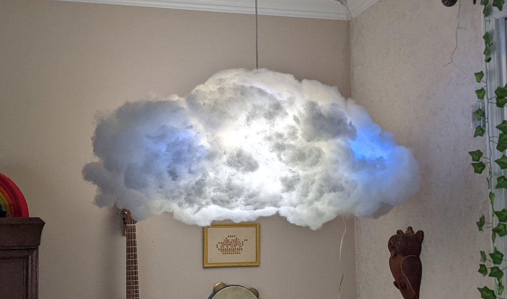

# Pufflux: A Colorful Cloud in my House

Pufflux makes a lamp that looks like a cloud. The lamp contains an Arudino-compatible microcontroller with a wifi
connection and many RGB LEDs. It periodically fetches the weather forecast for my area from the Internet and selects
colors and an animation style to tell me the weather.

The weather forecast comes from the United States' National Weather Service.

## History

This is version 2 of the project. Version 1 was built around an AVR microcontroller that didn't have any wifi hardware,
and used a garage-door style low power RF transceiver instead. This required an additional box with a microcontroller
(and another RF tranceiver) to be connected to an Internet-connected computer in order to feed it weather forecasts. Now
that wifi-enabled microcontrollers are cheap and easy to get, I decided to rebuild version 2 around it. In version 2
there's only the lamp software, because it can do all its own weather forecast work when it's connected to wifi.

You can find the code for version 1 in the "v1" branch.  There's a lot of Java in v1, including out-of-date
dependencies.  v2 is just C/C++ for the microcontroller.

# SSL Certificates

If you want to run this software, you'll have to upload SSL certificates to your microcontroller's
firmware.  See [the Adafruit documentation](https://learn.adafruit.com/adafruit-feather-m0-wifi-atwinc1500/updating-ssl-certificates)
for details.  Include certificates for these domains:

- geocode.arcgis.com
- api.weather.gov
